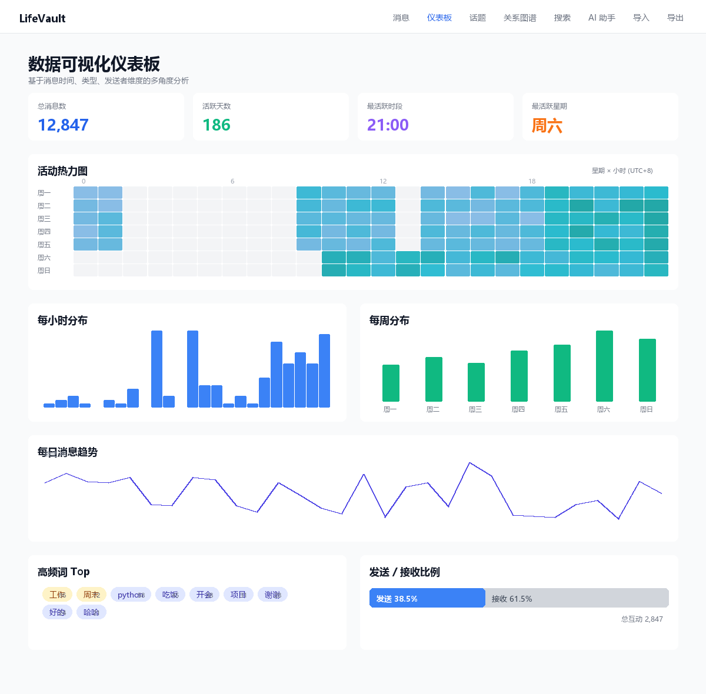
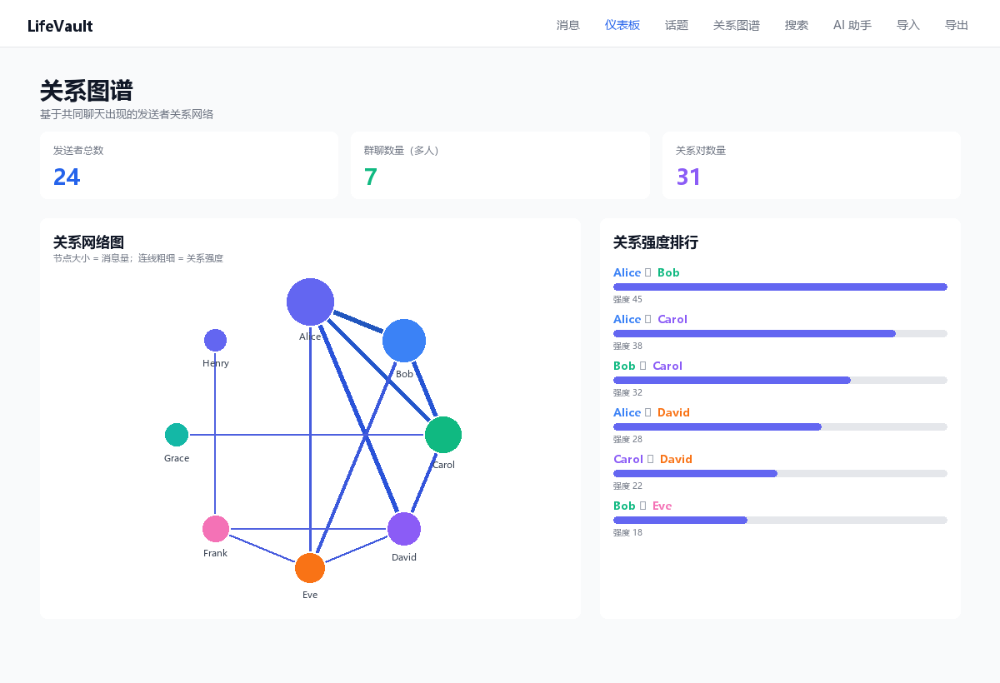

<div align="center">

# LifeVault

**你的微信数据私有化分析工具 · 本地部署 · 完全掌控**

[](https://github.com/shixiaogaoya/life-vault/actions/workflows/ci.yml)
[](LICENSE)
[](https://www.python.org/)
[](https://nuxt.com/)

隐私优先的微信聊天记录归档与分析平台。所有数据处理在本地完成，不上传任何服务器，不收集任何遥测。

[English](README_EN.md) · **简体中文** · [路线图](docs/ROADMAP.md) · [问题反馈](https://github.com/shixiaogaoya/life-vault/issues)

</div>

---

## 目录

- [核心特性](#核心特性)
- [快速开始](#快速开始)
  - [Docker 部署（推荐）](#docker-部署推荐)
  - [源码运行（开发）](#源码运行开发)
- [导入数据](#导入数据)
- [AI 功能（可选）](#ai-功能可选)
- [API 参考](#api-参考)
- [隐私设计](#隐私设计)
- [开发与测试](#开发与测试)
- [路线图](#路线图)
- [贡献与协议](#贡献与协议)

---

## 核心特性

| 维度 | 能力 |
|------|------|
| 🔒 **隐私优先** | 数据完全本地化，不上传服务器，无遥测，无云同步 |
| 🔍 **全文检索** | 基于 SQLite FTS5 的高性能中文/英文全文搜索 |
| 📊 **统计分析** | 消息分布、热门聊天、时间线、联系人活跃度对比 |
| 📈 **数据可视化** | 24×7 活动热力图、时段分布、每日趋势、词云、emoji 统计 |
| 🕸️ **关系图谱** | 基于共同聊天的发送者关系网络与强度排行 |
| 💬 **话题聚类** | 基于关键词共现的话题发现（零 NLP 依赖） |
| 📤 **多格式导出** | JSON / CSV / Markdown / HTML（含内嵌图表）/ 分析报告 |
| 🛡️ **导出隐私保护** | 脱敏手机号/身份证/邮箱/姓名地址，匿名化分享导出，密码/GPG 加密 |
| 🤖 **AI 智能助手** | 可选 RAG 问答与智能摘要，支持 OpenAI / Anthropic / Ollama |
| 🐳 **一键部署** | Docker 本机与远程服务器通用，开箱即用 |

### 界面预览

**数据可视化仪表板** — 24×7 活动热力图、时段分布、每日趋势、高频词、发送接收比例：



**关系图谱** — 基于共同聊天的发送者关系网络，节点大小代表消息量，连线粗细代表关系强度：



---

## 快速开始

### Docker 部署（推荐）

> 本机和远程服务器使用同一套命令。前端容器内置 nginx 反向代理 `/api/*`，浏览器只需访问 3000 端口。

```bash
git clone https://github.com/shixiaogaoya/life-vault.git
cd life-vault
docker compose up --build -d
```

首次启动约 2–5 分钟构建镜像，完成后访问：

| 服务 | 本机 | 远程服务器 |
|------|------|-----------|
| 前端 UI | http://localhost:3000 | http://\<服务器IP\>:3000 |
| API 文档 | http://localhost:8000/docs | http://\<服务器IP\>:8000/docs |

**常用维护命令：**

```bash
docker compose logs -f        # 实时日志
docker compose restart        # 重启
docker compose down           # 停止（保留数据卷）
docker compose down -v        # 停止并清空数据（⚠️ 不可逆）
```

<details>
<summary><b>远程服务器 HTTPS 反向代理（可选）</b></summary>

若服务器已有 nginx/caddy，把上游指向 3000 端口即可，无需改 LifeVault 配置：

```nginx
server {
    listen 443 ssl;
    server_name lifevault.example.com;
    # ... 证书配置 ...
    location / {
        proxy_pass http://127.0.0.1:3000;
        proxy_set_header Host $host;
        proxy_set_header X-Forwarded-Proto $scheme;
        client_max_body_size 256m;
    }
}
```

不想暴露 8000 端口时，可删除 `docker-compose.yml` 中 `backend.ports` 段，仅保留 3000 对外。

</details>

### 源码运行（开发）

适合修改代码或调试。

```bash
# 终端 1：后端
cd backend
pip install -e ".[dev]"
python -m app.main                      # http://localhost:8000

# 终端 2：前端（需显式指定后端地址，开发期端口分离）
cd frontend
# Windows:  $env:NUXT_PUBLIC_API_BASE = "http://localhost:8000"
# Linux:    export NUXT_PUBLIC_API_BASE=http://localhost:8000
npm install
npm run dev                             # http://localhost:3000
```

---

## 导入数据

Docker / 源码启动后**不会自动导入数据**。三种方式任选：

**1. 前端 UI 上传（最简单）** — 访问 3000 端口 → "导入数据" → 上传 LifeVault JSON 文件。无需额外配置。

**2. API 上传 JSON：**

```bash
curl -X POST http://localhost:8000/api/import -F "file=@sample_data/demo.json"
```

**3. 导入微信 SQLite 数据库（需挂载）：**

```bash
# docker-compose.yml 的 backend.volumes 增加：
#   - /宿主机/微信数据目录:/wechat:ro
curl -X POST http://localhost:8000/api/import \
  -H "Content-Type: application/json" \
  -d '{"source":"wechat_4x","db_path":"/wechat/MSG.db","contact_db_path":"/wechat/MicroMsg.db"}'
```

---

## AI 功能（可选）

AI 功能（RAG 问答、智能摘要）**默认禁用**，需显式配置环境变量启用。三种 provider：

| Provider | 隐私 | 需要配置 |
|----------|------|----------|
| **Ollama**（推荐） | ✅ 数据留在本地 | 仅需 `LIFEVAULT_LLM_PROVIDER=ollama` + 模型名 |
| OpenAI / DeepSeek / Moonshot | ⚠️ 发往云端 | 需 API Key |
| Anthropic Claude | ⚠️ 发往云端 | 需 API Key |

<details>
<summary><b>Ollama 配置示例（本地，隐私优先）</b></summary>

```bash
ollama pull llama3.2 && ollama pull nomic-embed-text && ollama serve

export LIFEVAULT_LLM_PROVIDER=ollama
export LIFEVAULT_LLM_MODEL=llama3.2
export LIFEVAULT_EMBEDDING_PROVIDER=ollama
export LIFEVAULT_EMBEDDING_MODEL=nomic-embed-text
```

</details>

<details>
<summary><b>OpenAI / Anthropic 配置示例</b></summary>

```bash
# OpenAI（兼容 DeepSeek/Moonshot，可用 LIFEVAULT_LLM_BASE_URL 自定义端点）
export LIFEVAULT_LLM_PROVIDER=openai
export LIFEVAULT_LLM_MODEL=gpt-4o-mini
export LIFEVAULT_LLM_API_KEY=sk-...

# Anthropic
export LIFEVAULT_LLM_PROVIDER=anthropic
export LIFEVAULT_LLM_MODEL=claude-sonnet-4-6
export LIFEVAULT_LLM_API_KEY=sk-ant-...
```

</details>

<details>
<summary><b>完整环境变量参考</b></summary>

| 变量 | 默认 | 说明 |
|------|------|------|
| `LIFEVAULT_DB_PATH` | `~/.lifevault/archive.db` | SQLite 数据库路径 |
| `LIFEVAULT_CORS_ORIGINS` | `http://localhost:3000` | 允许的前端来源（逗号分隔） |
| `LIFEVAULT_HOST` / `LIFEVAULT_PORT` | `127.0.0.1` / `8000` | 后端监听地址 |
| `LIFEVAULT_TIMEZONE_OFFSET` | `8` | 时区偏移（小时） |
| `LIFEVAULT_LLM_PROVIDER` | `disabled` | `disabled`/`openai`/`anthropic`/`ollama` |
| `LIFEVAULT_LLM_MODEL` | 空 | 模型名 |
| `LIFEVAULT_LLM_API_KEY` | 空 | API Key（Ollama 不需要） |
| `LIFEVAULT_LLM_BASE_URL` | provider 默认 | 自定义端点 |
| `LIFEVAULT_EMBEDDING_PROVIDER` | `disabled` | `disabled`/`openai`/`ollama`/`local` |
| `LIFEVAULT_EMBEDDING_MODEL` | 空 | Embedding 模型名 |
| `LIFEVAULT_EMBEDDING_DIMENSIONS` | `768` | 向量维度 |
| `LIFEVAULT_VECTOR_DB_PATH` | `~/.lifevault/vectors.db` | 向量库路径 |
| `LIFEVAULT_AI_TIMEOUT` | `60` | AI 请求超时（秒） |

</details>

启用后访问 `http://<地址>:3000/ai-chat` 即可。Docker 用户在 `docker-compose.yml` 的 `backend.environment` 中配置。

---

## API 参考

启动后访问 `http://<地址>:8000/docs`（Swagger）或 `/redoc` 查看完整文档。核心端点：

<details>
<summary><b>统计与分析</b></summary>

| 端点 | 方法 | 说明 |
|------|------|------|
| `/api/stats` | GET | 基础统计（总数、聊天数、数据源） |
| `/api/stats/visualization` | GET | 热力图、词云、emoji、媒体分布 |
| `/api/stats/contacts` | GET | 联系人 / 发送者活跃度对比 |
| `/api/stats/relationships` | GET | 关系图谱（共同聊天、强度） |
| `/api/stats/topics` | GET | 话题聚类 |

</details>

<details>
<summary><b>消息与搜索</b></summary>

| 端点 | 方法 | 说明 |
|------|------|------|
| `/api/messages` | GET | 分页查询消息 |
| `/api/messages/{id}` | GET | 单条消息详情 |
| `/api/search` | GET | FTS5 全文检索 |
| `/api/import` | POST | 导入 JSON 或微信数据库路径 |

</details>

<details>
<summary><b>导出（支持隐私参数）</b></summary>

| 端点 | 说明 |
|------|------|
| `/api/export/json` `/api/export/csv` | 结构化数据导出 |
| `/api/export/markdown` `/api/export/html` | 人类可读导出（HTML 含内嵌 SVG 图表） |
| `/api/export/report` | 分析报告（含可视化数据） |

**隐私查询参数：** `mask_sensitive`（脱敏手机号/身份证/邮箱/姓名地址）、`mask_terms=词1,词2`（自定义遮蔽）、`anonymize`（匿名化分享导出）、`encrypt_password`（`.lvenc` 加密）、`gpg_recipient`（GPG 加密）。

</details>

<details>
<summary><b>AI（需启用）</b></summary>

| 端点 | 方法 | 说明 |
|------|------|------|
| `/api/ai/status` | GET | AI 模块状态 |
| `/api/ai/chat` | POST | RAG 问答 |
| `/api/ai/summary` | POST | 智能摘要（日/周/月） |
| `/api/ai/index` | POST | 启动向量索引构建 |
| `/api/ai/index/status` | GET | 索引进度 |

</details>

---

## 隐私设计

LifeVault 将隐私作为核心原则，这是不可妥协的设计约束：

- **仅本地处理** — 所有数据在你掌控的机器/服务器上处理
- **无云同步** — 数据永不离开你部署的环境
- **无遥测** — 不收集任何使用数据
- **无外部调用** — 除非你显式启用 LLM（默认禁用），且启用云端 provider 时前端会明确警告

详见 [SECURITY.md](SECURITY.md) 与 [docs/PRIVACY_MASKING.md](docs/PRIVACY_MASKING.md)。

---

## 开发与测试

```bash
# 后端测试（133 个用例）
cd backend && python -m pytest tests/ -v

# 完整检查（pytest + 前端构建 + e2e）
.\scripts\check.ps1          # Windows
sh scripts/check.sh          # Linux/macOS
```

**技术栈：**
- **后端** — Python 3.11+ · FastAPI · SQLite + FTS5 · Pydantic · aiosqlite · httpx
- **前端** — Nuxt 3 · Vue 3 · TypeScript · Tailwind CSS · nginx（生产）

<details>
<summary><b>项目结构</b></summary>

```
life-vault/
├── backend/app/
│   ├── main.py            # 入口
│   ├── db.py              # 数据库 + 统计聚合（可视化/联系人/关系/话题）
│   ├── routers/           # API 路由（messages/search/stats/export/ai/import）
│   ├── adapters/          # 微信 4.x 数据适配器
│   ├── privacy/           # 脱敏与匿名化
│   ├── ai/                # LLM/Embedding/向量库/RAG/摘要（默认禁用）
│   └── utils/             # 文本/emoji 工具
├── frontend/              # Nuxt 3 + nginx.conf（含 /api 反代）
├── docker-compose.yml     # 一键启动
├── sample_data/           # 示例数据
├── scripts/               # 检查/导入/e2e 脚本
└── docs/                  # ROADMAP 等
```

</details>

---

## 路线图

完整路线图见 [docs/ROADMAP.md](docs/ROADMAP.md)。

- **v0.1.0** ✅ — 统一数据模型、FTS5 检索、RESTful API、基础前端、JSON/CSV 导出
- **v0.2.0（当前）** ✅ — 隐私脱敏/匿名化/加密导出、可视化仪表板、关系图谱、话题聚类、AI 助手（RAG+摘要）、向量索引
- **v0.3.0（规划中）** — Electron 桌面应用、跨平台打包、多数据源（QQ、Telegram）

---

## 贡献与协议

欢迎贡献代码、报告问题或提出建议 — 详见 [CONTRIBUTING.md](CONTRIBUTING.md)。

本项目基于 [MIT License](LICENSE) 开源。

**致谢：** LifeVault 受 [MemoTrace](https://github.com/LC044/WeChatMsg) 与 [WeChatDataAnalysis](https://github.com/lz233/WeChatDataAnalysis) 启发，并感谢 FastAPI、Nuxt 等开源项目。

---

<div align="center">

**LifeVault** — 让数据回归你的掌控 🔒

用 ❤️ 打造 · [问题反馈](https://github.com/shixiaogaoya/life-vault/issues) · [项目主页](https://github.com/shixiaogaoya/life-vault)

</div>
